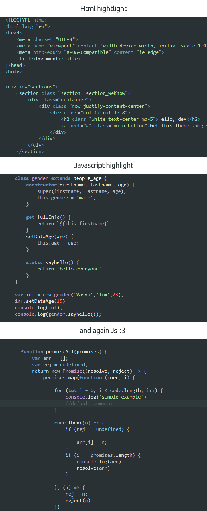
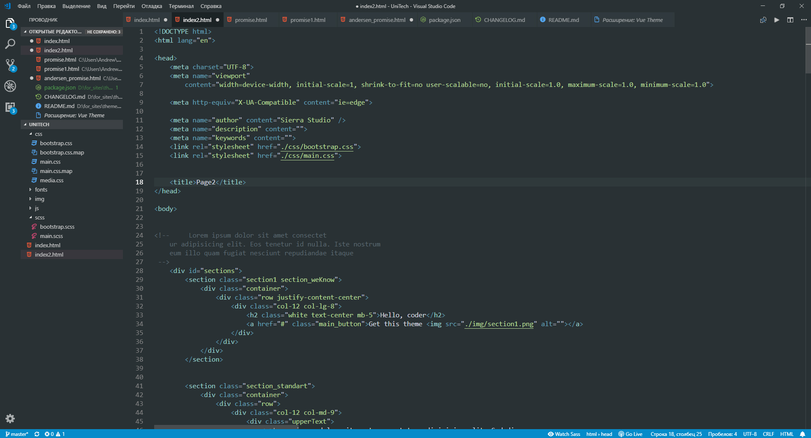

   

-------------------------------
-------------------------------
-------------------------------
-------------------------------
# MY WORKSPACE  

# SIMPLE README
1) install and select Vuewave theme in the themelist

### For more information
* [my website](https://sierra-studio.tech/)
* [github](https://github.com/avzcp4)

click a star so that I understand that you are using the theme. thks

)))

